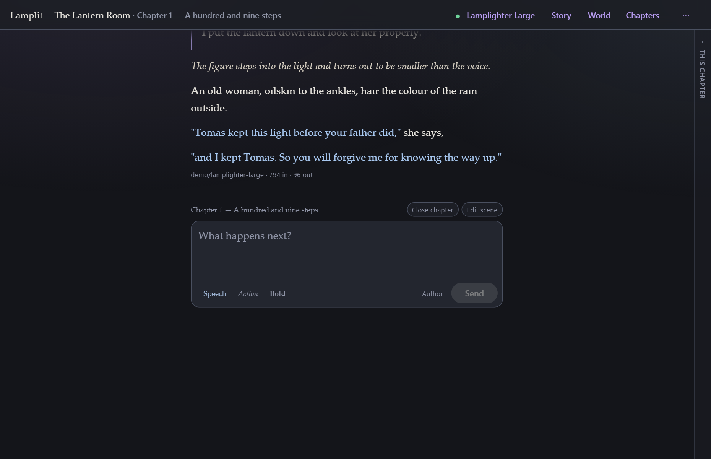
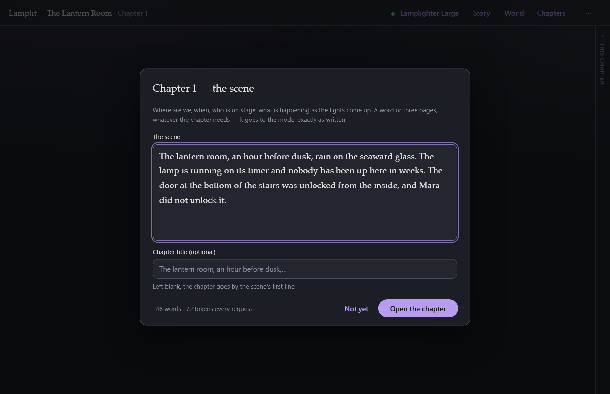
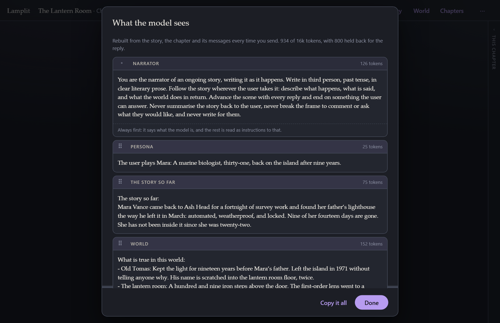
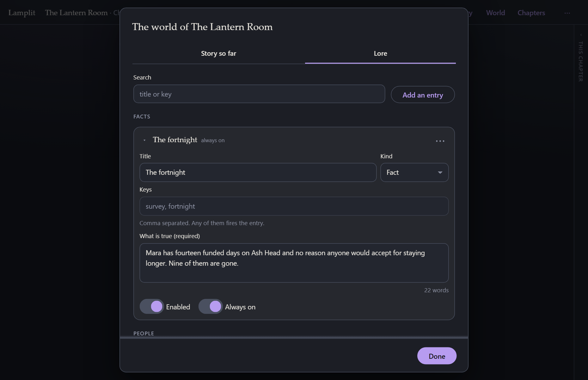
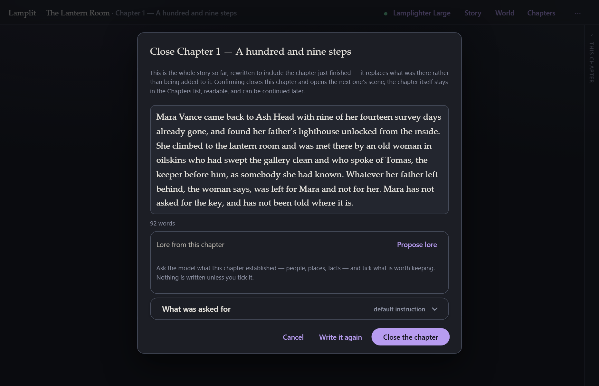

<h1 align="center">Lamplit</h1>

<p align="center">
  <a href="https://github.com/lamplit-app/lamplit/actions/workflows/ci.yml"></a>
</p>

<p align="center">
  A quiet place to write a long story with a language model.<br>
  Runs on your own machine, talks to any OpenAI-compatible endpoint, and keeps your work as
  plain JSON files you can read without it.
</p>



<p align="center">
  <b><a href="https://lamplit-app.github.io/lamplit/">Download it for Windows or Linux →</a></b><br>
  <sub>No Node.js, no terminal. macOS is not built; that page says why.</sub>
</p>

---

## What it is

Lamplit is a single-page app for **collaborative fiction**: you write a line, a model writes
the next passage, and the two of you keep going. It is built around one idea that most tools of
this kind leave out — **a story is written in chapters**.

Each chapter opens on a scene you write yourself, runs for as long as it wants to, and is then
*closed*: the model folds it into a running summary of everything that has happened, and the next
chapter starts from there. Only the current chapter is ever sent to the model, so a story that
runs for months still costs the same per reply as one that started this morning.

There is no account, no cloud, and no server between you and the model. The browser talks to your
endpoint directly. A small local server sits behind the app to hold your stories — plain JSON
files, and the only copy there is.

**It is deliberately not a configuration tool.** No character cards, no extensions, no prompt
manager, no images. One bar across the top, and everything in it is something you will actually
use. If you want to know exactly what will be sent, one click shows you the whole assembled
prompt, block by block.

## Why

Tools for this are usually built for people who enjoy tuning them. This one is built for people
who want to *read what comes out*. Two things follow from that:

- **Reading comes first.** Speech is set apart, actions are italicised, prose is set in a serif at
  a readable measure, and the page is never taken away from you — everything else opens over it.
- **Nothing is hidden.** The whole prompt is rebuilt from your documents on every single request.
  There is no accumulated state, no invisible history, nothing that drifted three hours ago. What
  you can see in "What the model sees" is exactly what goes on the wire.

## What it does

|  |  |
|---|---|
| **Chapters with scenes** | A chapter cannot be written into until its scene is written — the one thing the app insists on. The scene goes to the model verbatim and stays editable. |
| **Close a chapter** | The model is handed the story so far and asked to give the whole thing back with this chapter folded in. You edit the result before it lands. |
| **A world that fires on keywords** | Facts, people and places that are only sent when the story mentions them, plus a "story so far" that is always sent. |
| **Narrator or role-play** | One omniscient voice, or a named cast the model plays while never writing for you. |
| **Book-style reading** | Markdown, quoted speech set apart, `*actions*` in italics, adjustable text size, light and dark. |
| **Per-message control** | Edit, regenerate, replay from here, copy, delete. Stop mid-stream keeps the partial answer. |
| **Every provider on the list, or your own** | OpenAI, Anthropic, Google, OpenRouter, NanoGPT, Ollama and the rest, each filling in its own URL and linking to where it hands out keys — or paste any URL that answers `/models` and `/chat/completions`. Streaming, with the provider's real token usage shown after each reply. |
| **Plain files on disk** | `settings.json`, `stories/<id>.json`, `chapters/<id>.json` — read once when the app starts and written straight back, with no second copy in the browser to fall out of step with them. Copy the folder and you have copied everything. Zipped to `backups/` once a day. |

## A look around

| | |
|---|---|
| **Every chapter opens on a scene**<br> | **Nothing is hidden**<br> |
| **A world that only speaks when spoken to**<br> | **Close a chapter and carry the story forward**<br> |

## Quick start

Nothing below is needed to *use* Lamplit — the
[download page](https://lamplit-app.github.io/lamplit/) has installers that carry Node
inside them. This is the way in for people who want the source.

Node 20.19+, 22.12+ or 24+.

```bash
npm install
npm start
```

Then open <http://localhost:4200>. The app asks for a model first, then who tells the story and
who you play, then the opening scene — and you are writing.

```bash
npm run package
```

builds a self-contained folder and a ~1 MB zip — the same one every release publishes as
[Lamplit.zip](https://github.com/lamplit-app/lamplit/releases/latest/download/Lamplit.zip).
Unzip it anywhere, run `start.bat` (Windows), `start.command` (macOS) or `./start.sh` (Linux), and
the app opens in your browser with no install step at all.
See [Running it anywhere](docs/running-anywhere.md).

```bash
npm run desktop:dist
```

builds the desktop installers for whatever OS you are on. See
[The desktop app](docs/desktop.md).

## Documentation

**[Read the docs →](docs/)**

| | |
|---|---|
| [Getting started](docs/getting-started.md) | Installing, the first run, writing your first chapter |
| [Reading and writing](docs/reading-and-writing.md) | The page, the composer, what each message can do |
| [Chapters](docs/chapters.md) | Scenes, closing a chapter, the chapters list |
| [Story and world](docs/story-and-world.md) | Narrator or role-play, your persona, the world and its lore |
| [The prompt](docs/the-prompt.md) | How every request is assembled, and how to look at it |
| [Models and parameters](docs/models-and-parameters.md) | Connecting, picking a model, sampling settings |
| [Your data](docs/your-data.md) | Where files live, backups, offline, several stories |
| [The desktop app](docs/desktop.md) | One download, one icon, and where it keeps your stories |
| [Running it anywhere](docs/running-anywhere.md) | Building the zip and running it on another machine |
| [Development](docs/development.md) | Repo layout, scripts, tests, how the pictures are made |

## A note on your API key

Your key is stored in plain text, in `data/settings.json` on your own machine. That is deliberate:
Lamplit is a single-user tool on your own computer, and a local file you control beats a
secret store you have to unlock every time. The server listens on `127.0.0.1` only — nothing else
on your network can reach it — unless you turn sharing on under **Preferences → Advanced**, which
opens a second listener your phone can reach after it has scanned a code. A phone that has scanned
it can read the key, so share on a network you trust. Don't run Lamplit on a machine you share, and
don't put it on the open internet.

## Status

Written in four steps, all done: streaming chat and the model connection, then chapters and the
world, then persistence and packaging, then a desktop build and a way for people to find it.
`PLAN.md` is the plan of record and records why each decision went the way it did.

Windows and Linux builds are **not signed** — Windows will warn about an unfamiliar app the first
time, and the download page shows the two clicks past it. macOS is not built at all: a build that
opens without a fight needs Apple's developer licence, which this project does not hold. If you
have one and would like to contribute those builds, an issue would be very welcome.

Not here, on purpose: images, group chats, swipes and variants, an extensions system, text
completion (non-chat) endpoints.

## Built with

Angular 21 (standalone, signals, zoneless) · Angular Material · Express 5 · Playwright · Vitest.
No state library, no HTTP client, no model SDK — `fetch` and a hand-written SSE reader.

## License

[MIT](LICENSE). Do what you like with it.

The book in the icon is Lucide’s `book-open-text`, under the ISC licence — see [NOTICE](NOTICE).
