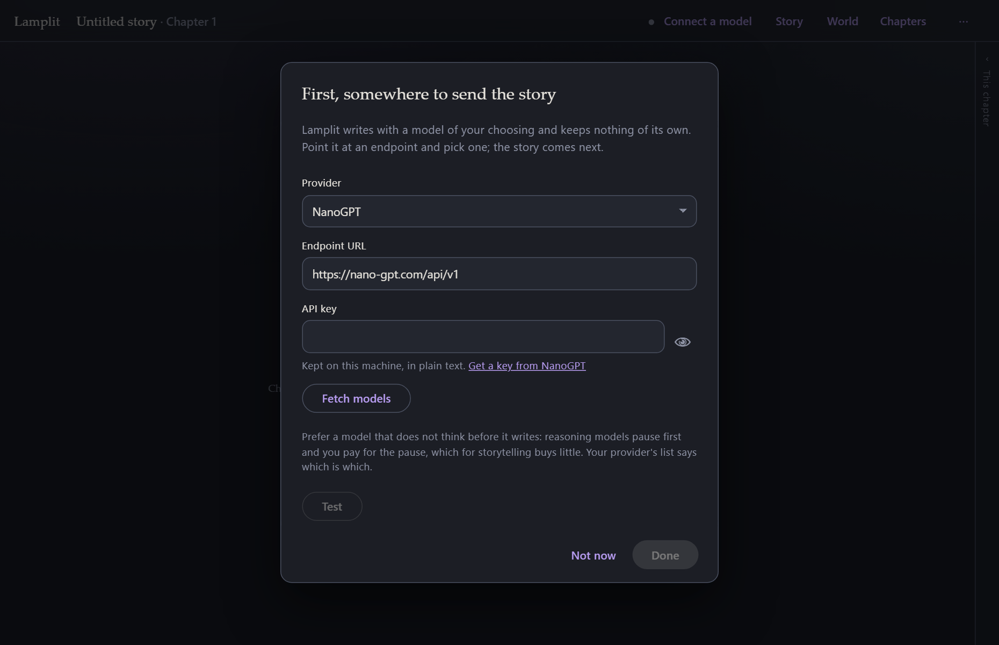
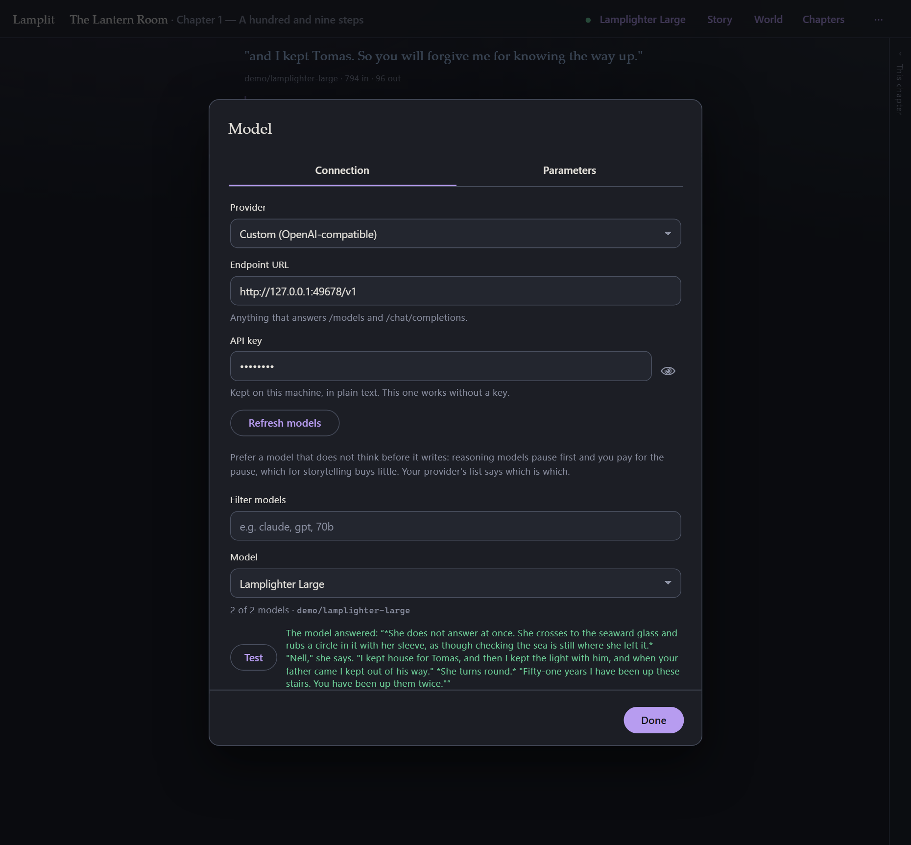
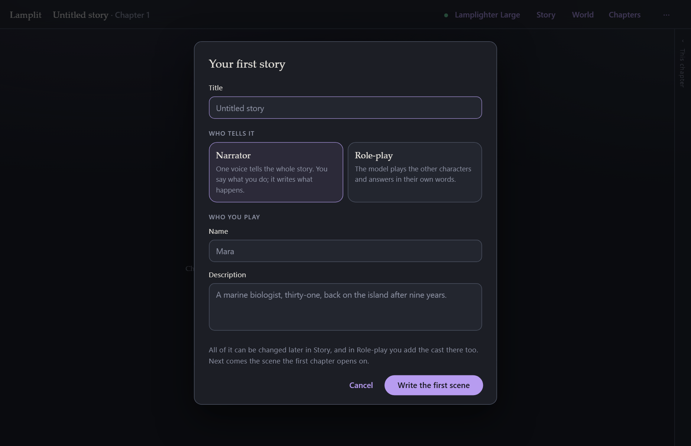
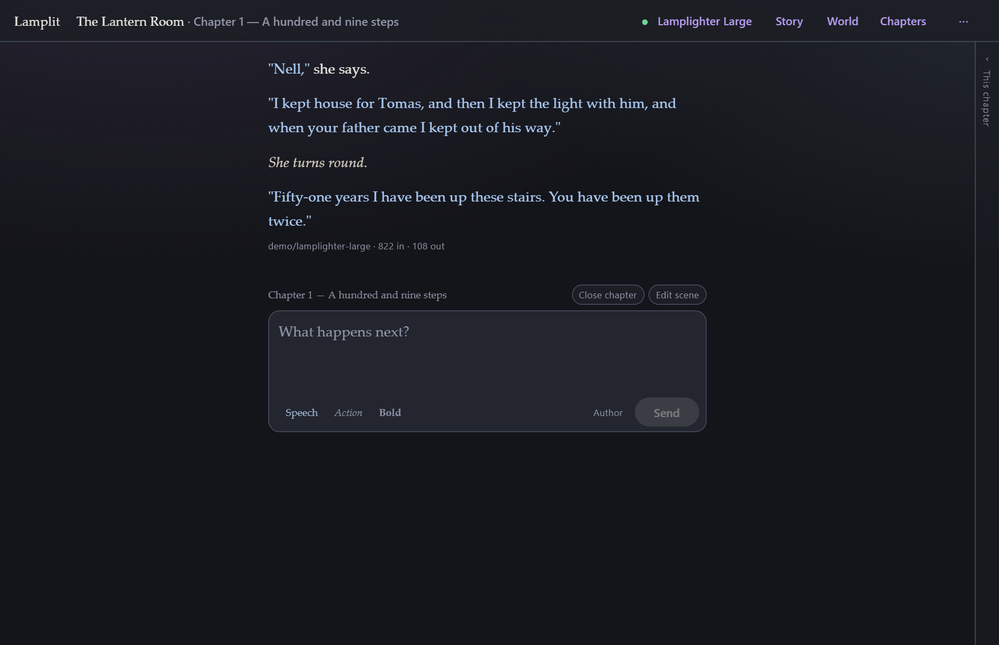

# Getting started

[← Documentation](README.md) · Next: [Reading and writing](reading-and-writing.md)

---

## Getting it

**[Download it from the front page.](index.md)** Windows and Linux; one file, one icon, and
nothing to install first. macOS is not built, and that page says what to do instead.

That is the whole of it. [The desktop app](desktop.md) covers where it keeps your stories and how
the window works.

## What you need besides

- **Somewhere to send the story** — a key from a provider, or a model running on your own machine.
  The app has twenty-two providers built in, each one filling in its own URL and linking to the
  page where it hands out keys; [Models and parameters](models-and-parameters.md) lists them all.
  You do not need an account with anyone in particular, and nothing is sold here.
- **Nothing else.**

## The other ways to run it

Neither is necessary; both exist because some people prefer them.

**The zip** — a megabyte, runs from one call, keeps your stories in a folder you chose. It needs
Node.js 20.19 or newer already on the machine, which is what its start scripts check for. See
[Running it anywhere](running-anywhere.md).

**From the source** — the way in for anyone who wants to change it:

```bash
npm install
npm start
```

`npm start` runs both halves of the app: the persistence server on
<http://localhost:4177>, and the dev server on <http://localhost:4200> which proxies `/api` to it.
Open **4200**. Everything comes from the public npm registry, and there is no postinstall step.
[Development](development.md) has the rest.

## The first run, in three questions

A fresh install asks you three things, in this order, and then gets out of the way. It never asks
again.

### 1. Where to send the story



This is the one screen the app opens on, because nothing else means anything until it knows where
to send the story. It will not take Escape for an answer, and **Done** stays dark until there is
an endpoint and a model. (There is a **Not now** if you want to look around first; the composer
will simply stay shut and tell you why.)

Pick your provider from the list — the URL fills itself in, and the key hint underneath links
straight to the page where that provider hands out keys. (Or pick **Custom** and type any URL,
which is how you reach a model running on your own machine.) Paste the key, press **Fetch
models**, choose one, and — worth doing once — press **Test**, which makes one real round trip and
tells you whether the whole path works.

Afterwards the same form is behind the model's name in the top bar — as the **Connection** tab of
**Model**, with **Parameters** beside it — and **Ctrl/Cmd+K** opens it from anywhere:



More on all of this in [Models and parameters](models-and-parameters.md).

### 2. Who tells the story, and who you play



- **Narrator** — one voice tells the whole story. You say what you do; it writes what happens.
- **Role-play** — the model plays the other characters and answers in their own words. You add
  the cast in **Story** afterwards.

**Who you play** is your persona: a name and a couple of lines. Both are optional, both are
editable later in **Story**, and both are sent with every request — which is why they are asked
for now rather than discovered later. See [Story and world](story-and-world.md).

### 3. The opening scene


This is the one compulsory step in the app. A chapter cannot be written into until its scene is
written, and any non-empty text will do.

Write it the way a scene opens in a playscript: where we are, when, who is on stage, and what is
happening as the lights come up. It is plain text — no fields, no schema, nothing parsed out of
it — and it reaches the model exactly as you typed it.

The **chapter title** underneath is optional. Left blank, the chapter is known by the scene's
first line.

Press **Open the chapter** and the composer appears.

## Writing the first line

Type what you do and press **Enter**. The answer streams in as it is written.



Some things worth knowing straight away:

| Key | Does |
|---|---|
| **Enter** | send |
| **Shift+Enter** | new line |
| **Ctrl/Cmd+Enter** | regenerate the last answer |
| **Ctrl/Cmd+K** | open Model — the connection, and its parameters |
| **Ctrl/Cmd+.** | the chapter panel, in and out |
| **Ctrl/Cmd+,** | open Preferences |
| **Escape** | close a modal — everything in it is already saved |

- **Stop** appears while an answer is streaming, and keeps whatever arrived before you pressed it.
- **context 805 / 16k** under the composer is what the next request will cost. Click it to see the
  whole prompt.
- Nothing has a Save button. Everything is written to disk as you type.

## Where to next

- Carry on writing, and when the chapter feels finished, read **[Chapters](chapters.md)** — the
  "close chapter" step is what makes long stories work here.
- Give the story a world: **[Story and world](story-and-world.md)**.
- Curious what is actually being sent? **[The prompt](the-prompt.md)**.
