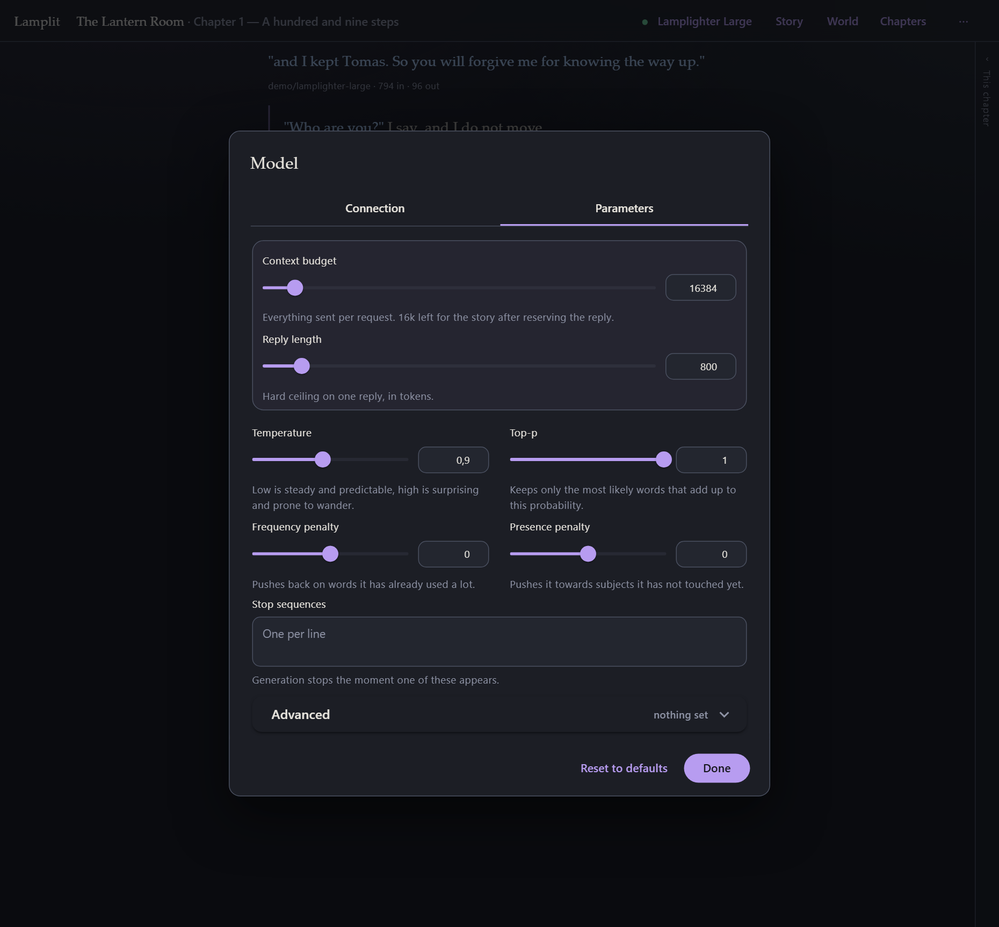

# Models and parameters

[← Documentation](README.md) · Previous: [The prompt](the-prompt.md) · Next: [Your data](your-data.md)

---

Both halves of this page are one sheet in the app. The model name in the top bar opens **Model**,
which has two tabs: **Connection** — where the story is sent — and **Parameters** — how the model
is asked to write once it gets there. They live in the same paragraph of `settings.json` and are
now in the same place on screen.

## Connecting

**Ctrl/Cmd+K**, or the model name in the top bar. It opens on this tab.

| | |
|---|---|
| **Provider** | Pick one and the URL fills itself in, with a link to the page where that provider hands out keys. **Custom** lets you type any URL that answers `GET /models` and `POST /chat/completions` in OpenAI's shape. The full list is [below](#the-providers-in-the-list). |
| **Endpoint URL** | Ends at `/v1` (or wherever your server puts those two paths). |
| **API key** | Sent as `Authorization: Bearer …`. Leave it empty for a local server that does not want one. |
| **Fetch models** | Reads the endpoint's own list. Filter it, then pick one. |
| **Model** | Prefer one that does not think before it writes. Reasoning models pause and then answer, and you pay for the pause as output tokens; for prose the wait buys little. Your provider's list says which models reason and which of theirs write best — ask them, not the app. Lamplit never asks a model to reason on its own; whether a model reasons when not asked is the model's default, and **Reasoning effort** under [Advanced](#advanced) is the only thing that changes it. |
| **Test** | One real round trip. Worth doing once — it tells you whether the URL, the key and the model all work together, rather than making you find out mid-sentence. |

Every change is saved the moment you make it, so however you close this sheet, it has already
been kept. On a fresh install the same form is the first thing on screen, without the tab strip
and without a way past it until there is an endpoint and a model — see
[Getting started](getting-started.md).

### The browser talks to the model directly

There is no proxy and no SDK. Your key goes from your browser to your provider and nowhere else —
in particular, not through the persistence server, which never sees it and has no idea a model
exists.

The one consequence is **CORS**: your endpoint has to allow browser requests. Every provider in
the list does — that is why they are in it. Most local servers do too, or have a flag for it. If a
request fails with a network error but the URL is right, that is almost always what happened.

### The providers in the list

Every one of these was checked from a browser on **2026-09-03** and allows the call: that is the
only thing that decides whether a provider can be in the list at all. `npm run providers` re-runs
the check and prints this table, so it can be brought up to date rather than trusted.

**Aggregators** — one key, many makers.

| | URL | Where the key comes from |
|---|---|---|
| OpenRouter | `https://openrouter.ai/api/v1` | openrouter.ai/keys |
| NanoGPT | `https://nano-gpt.com/api/v1` | nano-gpt.com/api |
| AIMLAPI | `https://api.aimlapi.com/v1` | aimlapi.com/app/keys |
| CometAPI | `https://api.cometapi.com/v1` | api.cometapi.com/console/token |
| ElectronHub | `https://api.electronhub.ai/v1` | playground.electronhub.ai |
| Chutes | `https://llm.chutes.ai/v1` | chutes.ai/app/api |
| Pollinations | `https://gen.pollinations.ai/v1` | free tier: no key needed |

**Hosted** — the model's own maker.

| | URL | Where the key comes from |
|---|---|---|
| OpenAI | `https://api.openai.com/v1` | platform.openai.com/api-keys |
| Anthropic | `https://api.anthropic.com/v1` | console.anthropic.com |
| Google Gemini | `https://generativelanguage.googleapis.com/v1beta/openai` | aistudio.google.com/apikey |
| Mistral | `https://api.mistral.ai/v1` | console.mistral.ai/api-keys |
| DeepSeek | `https://api.deepseek.com/v1` | platform.deepseek.com |
| xAI (Grok) | `https://api.x.ai/v1` | console.x.ai |
| Groq | `https://api.groq.com/openai/v1` | console.groq.com/keys |
| Together | `https://api.together.xyz/v1` | api.together.xyz/settings/api-keys |
| Fireworks | `https://api.fireworks.ai/inference/v1` | fireworks.ai/account/api-keys |
| Cohere | `https://api.cohere.ai/compatibility/v1` | dashboard.cohere.com/api-keys |
| Moonshot (Kimi) | `https://api.moonshot.ai/v1` | platform.moonshot.ai |
| Z.ai (GLM) | `https://api.z.ai/api/paas/v4` | z.ai/manage-apikey/apikey-list |
| SiliconFlow | `https://api.siliconflow.com/v1` | cloud.siliconflow.com/account/ak |
| MiniMax | `https://api.minimax.io/v1` | platform.minimax.io |
| Perplexity | `https://api.perplexity.ai` | perplexity.ai/settings/api |

**Run locally** — a model on this machine, no key and no bill.

| | URL |
|---|---|
| Ollama | `http://localhost:11434/v1` |
| LM Studio | `http://localhost:1234/v1` |
| llama.cpp server | `http://localhost:8080/v1` |
| vLLM | `http://localhost:8000/v1` |
| KoboldCpp | `http://localhost:5001/v1` |
| TabbyAPI | `http://localhost:5000/v1` |
| text-generation-webui | `http://localhost:5000/v1` |

Anything else OpenAI-compatible works too, under **Custom**; only streaming chat completions are
used.

Three of these need one thing said about them:

- **Anthropic** only answers a browser when the request says the key is meant to be in one. It
  does, always — this app has no server to hide a key on. Nothing to switch on.
- **Perplexity** publishes no model list, so Lamplit carries its five, and there is no
  **Fetch models** button to press.
- **SiliconFlow** and **MiniMax** run separate hosts for mainland China (`api.siliconflow.cn`,
  `api.minimaxi.com`). Use **Custom** with that URL.

## Parameters

The second tab of the same sheet.

### The two that matter most

- **Context budget** — everything sent per request, in tokens. The prompt builder trims the
  oldest messages to fit it. See [The prompt](the-prompt.md).
- **Reply length** — a hard ceiling on one answer, in tokens. It is reserved out of the budget
  before trimming, which is why the hint under the budget says how much is left for the story.

### The usual sampling set

| | |
|---|---|
| **Temperature** | Low is steady and predictable, high is surprising and prone to wander. |
| **Top-p** | Keeps only the most likely words that add up to this probability. |
| **Frequency penalty** | Pushes back on words it has already used a lot. |
| **Presence penalty** | Pushes it towards subjects it has not touched yet. |
| **Stop sequences** | Generation stops the moment one of these appears. |

### Advanced

Behind the **Advanced** panel: `top_k`, `min_p`, `repetition_penalty`, `top_a`, `seed` and
`reasoning_effort`.

These are **only sent once you switch them on.** An endpoint that does not understand
`repetition_penalty` never sees the field, so turning one on for NanoGPT does not break the same
story pointed at something stricter later.

**Reset to defaults** puts the whole set back.

> Parameters are global, not per story — they are how *you* like models to behave, and they live
> in `settings.json` next to your connection, which is why they are the tab beside it.

## Reading the numbers

Under each answer (when **Show token counts** is on in **Preferences → Reading**) is the model
that wrote it and the turn's real cost as the provider reported it: `612 in · 148 out`.

With **Developer mode** on in **Preferences → Advanced**, the context pill under the composer is
the *estimate* for what you are about to send. Comparing the two over a few turns tells you how far
off the estimate is for your model, and whether your budget is where you want it.
