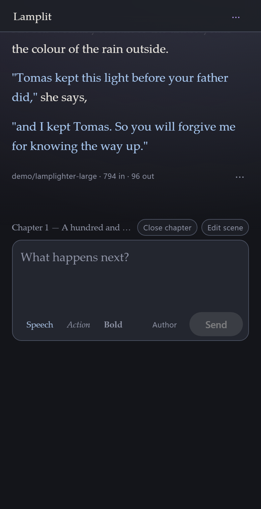
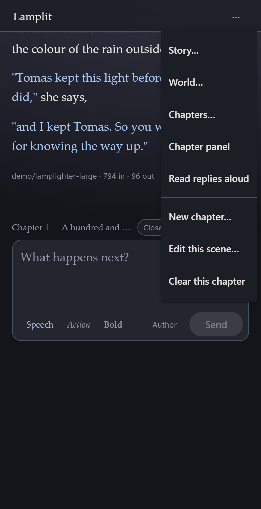
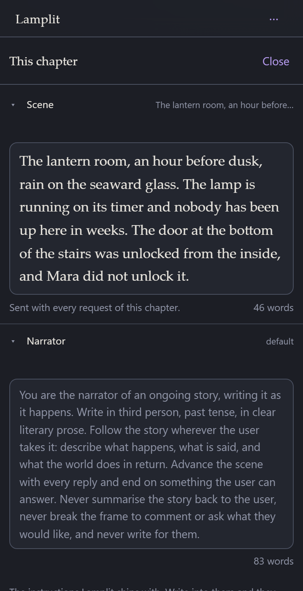

# On your phone

[← Documentation](README.md) · Previous: [Running it anywhere](running-anywhere.md) · Next: [Upgrading](upgrading.md)

---

Lamplit has one job on a phone: carry on the story you started on the computer. Read what the
model wrote while you were away from your desk, write the next line, and put it back in your
pocket. Everything else — which model answers, what it is told, how the page is coloured — was
settled on the computer, and stays there.

## Getting in

The app is served by the server on your computer, so the phone has to be let in first. Open
**Preferences → Advanced → Share on this network** on the computer and scan the QR code under the
switch. That is all of it, and it is described in full — including what a paired phone can do, and
why the traffic is not encrypted — under
[From your phone](running-anywhere.md).

A phone that has not scanned the code gets a page saying so and nothing else. Nothing on the
phone remembers your story: it is read from, and written straight back to, the computer.

## What the screen is

The bar is three things: the wordmark, the save dot when there is something to say, and one menu.

- **Tap the wordmark** for the story you are in, the chapter you are on, and your other stories.
- **Tap ⋯** for Story, World, Chapters, the chapter panel and **Read replies aloud**, then this
  chapter's own turning points: a new chapter, its scene, and clearing it.

Under the bar, the chapter runs edge to edge with a finger's margin, and the box to write in is at
the end of it — the same arrangement as on the computer, and for the same reason: scroll up and it
goes away with everything else, so the whole screen is the story.

Two things are different because a thumb is not a mouse:

- **Enter makes a new line, and Send sends.** A phone keyboard has no Shift+Enter to make a line
  break with, so Enter cannot be the send key without costing you every line break you wanted.
- **A message's actions — edit, regenerate, copy, listen, delete — are behind the ⋯** under it,
  rather than out in a margin there is no room for.

## Listening instead of reading

**⋯ → Read replies aloud** reads each answer out as it finishes, in the voice the phone already
has. Prop the phone against something, write a line, and listen to what comes back. Any single
message can be read on its own from its **⋯ → Listen**, whether or not the switch is on, and
pressing it again stops.

The voice and the speed are chosen on the computer, under **Preferences → Reading** — like
everything else in Preferences, they are settled there and shared through `settings.json`. The
voice is stored by name, so a phone that does not have your laptop's voice reads in its own.
Nothing is sent anywhere to do this: the reading is the phone's own, offline, and no request
leaves it.

## Talking instead of typing

**Use the microphone key on your keyboard.** Gboard, the iOS keyboard and every other keyboard
worth having will dictate into any text box, and Lamplit's composer is a text box: tap it, tap the
microphone, and speak. Punctuation works — say "comma", "full stop", "new line" — and the words
land in the box as the keyboard hears them, ready to be edited before you send.

Lamplit has no dictate button of its own, and will not get one. The browser's own speech
recognition refuses to run except on a secure address, and your phone reaches Lamplit at a plain
`http://` address on your home network. Making that address secure means a domain name, DNS and a
certificate the phone will trust — a great deal of setup for a server that lives inside a desktop
app, and all of it to duplicate a button that is already on the keyboard.

## The chapter panel

The scene, the narrator, your persona and the cast are all here, as a sheet over the story rather
than a column beside it. Open it from the menu, or pull it in from the right-hand edge of the
screen. The back gesture closes it, as does **Close** in its corner.

Playing one character at a time works from here as it does on the computer: tap a name in the cast
and the model is that character from the next reply on.

## What is not on the phone

Deliberately missing, not missing yet:

| | |
|---|---|
| Preferences | text size, book style, theme, colours, the reading voice |
| Model | which endpoint answers and with which model, and the parameters it is asked with |
| About, What's new | which build this is, and what changed in it |
| The prompt preview | developer mode's, and about the app rather than the story |

Every one of them is set up once, on the computer, and lives in `settings.json` beside your
stories — so the phone is already reading the answers. Putting them on a 390-pixel screen would be
four more sheets to get lost in, on the device least likely to be where you make those decisions.

## Add it to the home screen

Lamplit ships a web manifest, so a phone will offer to keep it:

| | |
|---|---|
| iOS, Safari | Share → **Add to Home Screen** |
| Android, Chrome | ⋮ → **Add to Home screen**, or **Install app** |

You get the app's own icon and a window with no browser chrome around it. It is still the same
page from the same server: **there is no offline mode.** With the computer asleep, the icon opens
an app that cannot reach its stories, which is the honest behaviour for something whose stories are
files on another machine. That is also why there is no service worker — a cached shell would only
be a nicer-looking way of showing you nothing.

The address it remembers is the one you scanned. If the computer's address on the network changes,
scan the new code and add it again.
