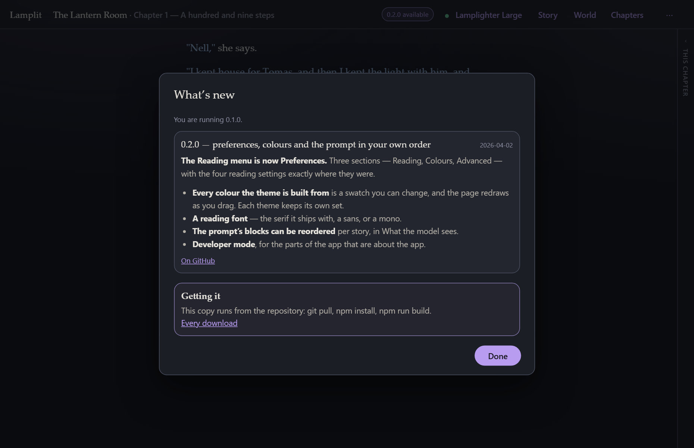

# Upgrading

[← Documentation](README.md) · Previous: [On your phone](on-your-phone.md) · Next: [Development](development.md)

---

Every way of running Lamplit keeps your stories somewhere the new version can find them, so
upgrading is: get the new one, run it. The one thing worth knowing per channel is whether the
stories sit *inside* what you are replacing.

## Whichever you have

| You have | Upgrade by | Your stories |
|---|---|---|
| The **installer** | Running the new installer over the old one. No need to uninstall first. | In your profile. Not touched. |
| The **portable .exe** | Replacing the `.exe` with the new one. | In the `data` folder beside it. Keep that folder. |
| The **zip** | Unzipping the new folder, then carrying `data` across (below). | Inside the old folder. **Move it, or point at it.** |
| **The source** | `git pull && npm install`, then `npm run build`. | In `data/` at the repo root. Not touched. |

The zip is the only one that needs a decision, because the folder you downloaded holds both the
app and — after the first run — the stories.

## The zip, in detail

Unzip the new version beside the old one. Then either **move the data across**:

```bash
# Windows (PowerShell)
Move-Item lamplit-0.2.0\data lamplit-0.2.1\data

# macOS, Linux
mv lamplit-0.2.0/data lamplit-0.2.1/data
```

…or leave it where it is and **tell the new one where to look**:

```bash
./start.sh --data ../lamplit-0.2.0/data
```

Either works; moving it is tidier, and then the old folder can be deleted whole. `backups` can
travel the same way, or be left behind — it is only ever written to.

Nothing is registered with the operating system, so there is no uninstall step: deleting the old
folder is the whole of it.

## Where each way of running it keeps your stories

One place to look, since the answer decides everything above.

| | `data` lives |
|---|---|
| Installer (Windows) | `%APPDATA%\Lamplit\data` — `C:\Users\<you>\AppData\Roaming\Lamplit\data` |
| Installer (.deb, AppImage) | `~/.config/Lamplit/data` |
| Portable .exe | beside the `.exe` |
| The zip | beside `start.bat` / `start.command` / `start.sh` |
| The repo | `data/` at the repo root |
| Anywhere | wherever `--data` or `LAMPLIT_DATA_DIR` says |

In the desktop app, **File → Open data folder** opens it without any of that typing. The layout
inside is the same everywhere and is described in [Your data](your-data.md); a daily zip of it
lands in `backups` next door when the app starts, which is your safety net if an upgrade goes
somewhere you did not intend.

## How you hear about a new one

Every way of running Lamplit checks, once, when it starts: the server asks GitHub which versions
have been published, and the top bar says so when one of them is newer than the one you are
running.



It is a small pill — *0.2.1 available* — and nothing else. No modal, no banner over the page you
are writing on. Click it for **What's new**: every release above yours, newest first, with the
notes as they were written, and a line at the bottom about getting it on the channel you are
using. The same sheet, showing every release, is under **⋯ → About Lamplit → Release notes**,
because the notes are worth reading with nothing pending.

What the desktop app does with the answer is what it always did: **electron-updater** downloads
the new version on its own and installs it the next time you quit. The zip and a copy running from
the repository have nothing to install for you, so the sheet links to the download instead.

> **What leaves your machine.** One request, to `api.github.com`, asking for the list of published
> releases. It carries what any HTTP request carries — a URL, a user agent and your IP — and
> nothing about you, your stories or your provider. The server makes it, not the browser, so the
> only host the app itself ever talks to is still the model endpoint you chose. The desktop app's
> updater asks the same project's releases a second time, for the installer rather than the notes,
> and only when the check below is on.

**Switching it off.** **Preferences → Advanced → Check for a new version when Lamplit starts.**
Off means the server is not asked, so GitHub is not asked either — the request does not happen
rather than happening and being ignored. In the desktop app the same switch stands the installer's
own updater down with it: nothing is fetched, nothing is downloaded, and nothing is waiting to
install when you quit. `LAMPLIT_UPDATE_CHECK=0` in the environment does the same for a zip started
by a script:

```bash
LAMPLIT_UPDATE_CHECK=0 ./start.sh
```

With it off, **Release notes** in About still works: opening that sheet is you asking, so it asks
then.

## What the app does when it notices

The server writes the version it is running into `data/lastRun.json`. When it starts and finds a
different one there, it says so in its log —

```
upgraded 0.2.0 → 0.2.1
```

— and the app shows one line at the top of the page: *Lamplit was upgraded to 0.2.1*, with a link
to what changed in it. Dismiss it and it is gone for good; it is recorded in `settings.json`, so
it never appears twice for the same version.

That is the other half of the same story: the pill above is *before* you upgrade, this line is
after. Both point at the same [release notes](releases.md).

A fresh unzip with no `data` folder has nothing to compare against and says nothing, which is
right — there is no upgrade to report. Neither is anything reported by a build that carries the
same version number as the one before it.

## Which build am I running?

**⋯ → About Lamplit**, which is the answer to give in a bug report:

```
Version 0.2.1
build 42 · a1b2c3d · 2026-09-04 · zip
```

The version alone stops being enough once two builds have carried it. The build number is the CI
run that made it, the short SHA is the commit it was built from (with a `+` if the tree was not
clean), and the last word is how it is being run — `desktop`, `zip`, or `dev` for a copy running
from the repository. In the desktop app the same line is under **Help**, and `/api/health` returns
every field of it for anyone scripting against the server.

## Downgrading

Nothing stops it: install the older version, or run the older folder. Documents are merged field
by field when they are read, so a `settings.json` written by a newer version loads in an older one
— it ignores what it does not know. The upgrade notice stays quiet on the way down, because
"what's new" would be a page about the version you just left.
